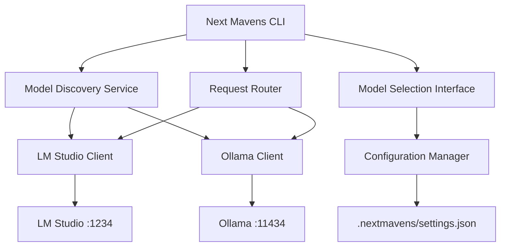
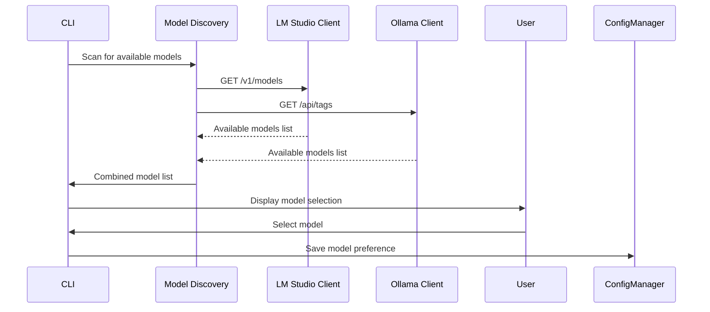

# Design Document

## Overview

This design transforms the Gemini CLI into "Next Mavens", a local LLM-powered development tool that connects to LM Studio and Ollama instead of external APIs. The system will automatically discover available models, provide a selection interface, and route requests to the appropriate local service using their respective API formats.

## Architecture

### High-Level Architecture



### Service Discovery Flow



## Components and Interfaces

### 1. Model Discovery Service

**Purpose**: Automatically detect and catalog available models from local LLM services.

**Interface**:
```typescript
interface ModelDiscoveryService {
  scanAvailableModels(): Promise<AvailableModel[]>;
  checkServiceHealth(service: LocalLLMService): Promise<ServiceStatus>;
  refreshModelList(): Promise<void>;
}

interface AvailableModel {
  id: string;
  name: string;
  service: 'lmstudio' | 'ollama';
  size?: string;
  capabilities?: ModelCapabilities;
}

interface ServiceStatus {
  available: boolean;
  endpoint: string;
  error?: string;
}
```

**Implementation Details**:
- Scans LM Studio at `http://localhost:1234/v1/models` (OpenAI-compatible)
- Scans Ollama at `http://localhost:11434/api/tags`
- Handles custom host/port configurations
- Implements timeout and retry logic
- Caches results for performance

### 2. Local LLM Clients

#### LM Studio Client
**Purpose**: Interface with LM Studio using OpenAI-compatible API.

**Interface**:
```typescript
interface LMStudioClient extends LocalLLMClient {
  generateContent(request: GenerateContentRequest): Promise<GenerateContentResponse>;
  generateContentStream(request: GenerateContentRequest): AsyncGenerator<GenerateContentResponse>;
  listModels(): Promise<ModelInfo[]>;
}
```

**Implementation**:
- Uses OpenAI-compatible endpoints (`/v1/chat/completions`, `/v1/models`)
- Handles streaming responses
- Implements proper error handling and retries

#### Ollama Client
**Purpose**: Interface with Ollama using its native API.

**Interface**:
```typescript
interface OllamaClient extends LocalLLMClient {
  generateContent(request: GenerateContentRequest): Promise<GenerateContentResponse>;
  generateContentStream(request: GenerateContentRequest): AsyncGenerator<GenerateContentResponse>;
  listModels(): Promise<ModelInfo[]>;
}
```

**Implementation**:
- Uses Ollama-specific endpoints (`/api/generate`, `/api/chat`, `/api/tags`)
- Converts between Ollama format and internal format
- Handles Ollama-specific features and limitations

### 3. Request Router

**Purpose**: Route requests to the appropriate local service based on selected model.

**Interface**:
```typescript
interface RequestRouter {
  routeRequest(request: GenerateContentRequest, model: AvailableModel): Promise<GenerateContentResponse>;
  routeStreamRequest(request: GenerateContentRequest, model: AvailableModel): AsyncGenerator<GenerateContentResponse>;
}
```

**Implementation**:
- Maintains mapping of models to services
- Handles protocol translation between services
- Implements failover logic if primary service becomes unavailable

### 4. Configuration Manager

**Purpose**: Manage user preferences and service configurations.

**Interface**:
```typescript
interface ConfigurationManager {
  getSelectedModel(): Promise<AvailableModel | null>;
  setSelectedModel(model: AvailableModel): Promise<void>;
  getServiceConfig(service: LocalLLMService): ServiceConfig;
  setServiceConfig(service: LocalLLMService, config: ServiceConfig): Promise<void>;
}

interface ServiceConfig {
  host: string;
  port: number;
  enabled: boolean;
  timeout: number;
}
```

### 5. Model Selection Interface

**Purpose**: Provide interactive model selection UI.

**Implementation**:
- React-based selection component using Ink
- Displays available models with service indicators
- Shows model capabilities and performance hints
- Allows filtering and searching through available models

## Data Models

### Core Data Structures

```typescript
interface GenerateContentRequest {
  messages: ChatMessage[];
  model: string;
  temperature?: number;
  maxTokens?: number;
  stream?: boolean;
}

interface GenerateContentResponse {
  content: string;
  usage?: TokenUsage;
  model: string;
  finishReason?: string;
}

interface ChatMessage {
  role: 'user' | 'assistant' | 'system';
  content: string;
}

interface TokenUsage {
  promptTokens: number;
  completionTokens: number;
  totalTokens: number;
}
```

### Configuration Schema

```typescript
interface NextMavensConfig {
  selectedModel?: {
    id: string;
    service: 'lmstudio' | 'ollama';
  };
  services: {
    lmstudio: ServiceConfig;
    ollama: ServiceConfig;
  };
  ui: {
    theme: string;
    autoRefreshModels: boolean;
  };
}
```

## Error Handling

### Error Categories

1. **Service Unavailable**: LM Studio or Ollama not running
2. **Model Not Found**: Selected model no longer available
3. **Network Errors**: Connection timeouts or failures
4. **API Errors**: Invalid requests or service errors
5. **Configuration Errors**: Invalid settings or missing config

### Error Handling Strategy

```typescript
interface ErrorHandler {
  handleServiceUnavailable(service: LocalLLMService): Promise<void>;
  handleModelNotFound(modelId: string): Promise<AvailableModel>;
  handleNetworkError(error: NetworkError): Promise<void>;
  handleAPIError(error: APIError): Promise<void>;
}
```

**Implementation**:
- Graceful degradation when services are unavailable
- Automatic model re-selection when current model becomes unavailable
- Clear error messages with actionable suggestions
- Retry logic with exponential backoff
- Fallback to alternative models when possible

## Testing Strategy

### Unit Testing
- Mock HTTP clients for LM Studio and Ollama APIs
- Test model discovery logic with various service states
- Validate request routing and protocol translation
- Test configuration management and persistence

### Integration Testing
- Test against real LM Studio and Ollama instances
- Validate end-to-end model selection and usage flows
- Test error handling with service failures
- Verify performance with different model types

### User Acceptance Testing
- Manual testing of model discovery and selection
- Validation of rebranding across all user interfaces
- Testing of custom configuration scenarios
- Performance testing with various local models

## Migration Strategy

### Phase 1: Core Infrastructure
- Replace Gemini API client with local LLM clients
- Implement model discovery service
- Update configuration system

### Phase 2: Rebranding
- Update all package names and references
- Change command name from "gemini" to "next-mavens"
- Update configuration directories and file names
- Rebrand all user-facing text and documentation

### Phase 3: Enhanced Features
- Add model performance monitoring
- Implement advanced model selection features
- Add support for custom model configurations
- Enhance error handling and user feedback

### Backward Compatibility
- Migrate existing `.gemini` configurations to `.nextmavens`
- Provide clear migration instructions for users
- Maintain configuration file format compatibility where possible